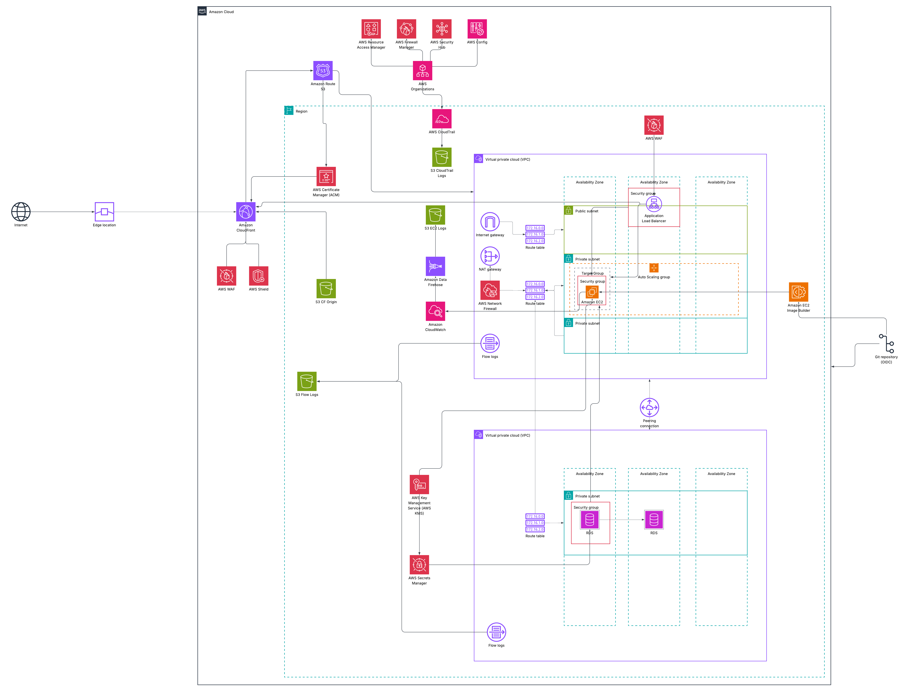

# Multi-Account AWS Web + Database Project (Terraform + Ansible + GitHub OIDC)

## Overview
This project is a **basic web/database architecture** enhanced with **extra services**, **security controls**, and **network isolation**.

It uses:
- **GitHub OIDC** for authentication/authorization to AWS
- **Terraform** as Infrastructure as Code (IaC)
- **Ansible** for configuring **EC2 instances**

The AWS environment is structured as a **multi-account setup**:
- **Management**
- **Network**
- **Security**
- **Prod**

---

## Diagram
Project diagrams are stored under diagram/* with multiple formats.

---

## Account Responsibilities
### Management Account
- Organization-level management (root of the multi-account structure)

### Security Account
- Central security governance and monitoring:
  - Firewall Manager
  - Config
  - CloudTrail
  - Security Hub

### Network Account
Responsible for shared networking and connectivity:
- Deploying **VPCs**
- Sharing VPC resources via **AWS RAM**
- Managing **routes**
- Managing **connectivity between VPCs**
- Managing **Route 53**

### Prod Account
- Hosts **everything else**, including:
  - Application workloads
  - Databases
  - CloudFront distribution components (as applicable)
  - ALB + EC2 + S3 content (as applicable)

---

## Notes
- The project is designed with **network isolation** and **security best practices** in mind.
- The goal is a clean separation of concerns between:
  - **Network operations**
  - **Security governance**
  - **Production workloads**

## High-Level Architecture
### Deployment Flow (Git → AWS)
1. Source code and infrastructure definitions are stored in **GitHub**
2. **GitHub OIDC** is used to authenticate securely to AWS (no static credentials)
3. **Terraform** provisions AWS infrastructure
4. **EC2 Image Builder** is used to build **custom AMIs**
   - AMIs are created using predefined recipes
   - **Ansible** runs during image build to configure the system and application

### Traffic Flow (Client → Application)
1. Clients connect using a **domain name registered in an AWS account**
2. Requests go through **Amazon CloudFront**
3. CloudFront uses **two origins**:
   - **ALB** (Application Load Balancer) for dynamic web/application traffic
   - **S3** for **static files**

## Logging, Availability, and Scalability
- **All logs are centralized and stored in S3 buckets**, including:
  - Application logs
  - Security logs
  - Service and infrastructure logs
- The **web application layer** is:
  - **Highly available**
  - **Horizontally scalable** (behind an Application Load Balancer)

## Important Note
> In this project, the **database is deployed on EC2 instances**.  

